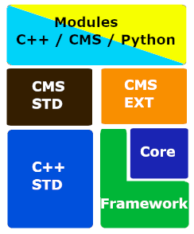

# CMS (C++ Modular Scripting) [*Early Access*]



**Project Status:**

Build: Stable  
Type: Early Access  
Tests: Full  
Documentation: Full

**CMS allow to script in C++ syntax.**

Can work in 2 ways:

compiled as c++ source  
scripted as converted to python

For example CMS(C++) file converted to python file:

 **C++:**

```cpp
#include <cms>

cms::sometype type_1 = INITIALIZER_LIST("heel", "check", "top")

struct MyStruct : OtherStruct, ParentStruct { 
  void fun(const cms::string& name, int* type, char val) {
    while(a > 5 && c <= 9 || (a == 12 && c < d)) {
      print("hello");
    }
  }
}
// Some comment
```

**Python:**

```python
import cms

type_1 = {"heel", "check", "top"}


class MyStruct(OtherStruct, ParentStruct):

  def fun(self, name, type, val):
    while a > 5 and c <= 9 or (a == 12 and c < d):
      print("hello")

# Some comment
```

## Examples

See examples folder to check how files are converted from CMS(C++) to python.

## Supported C++ syntax

| syntax   | cms                              | converted to Python |
| -------- | -------------------------------- | ------------------- |
| inherits | public **only**                  | yes                 |
| class    | struct **only**                  | class               |
| if       | if (){}  **no else and else if** | if                  |
| while    | while (){}                       | while               |
| comments | // **only**                      | #                   |
| import   | #include <cms/...> **only**      | import              |
| function | void fun(void){}                 | def fun(): pass     |

## Supported C++ std lib

| syntax            | cms                 | equivalent C++                  | converted to Python |
| ----------------- | ------------------- | ------------------------------- | ------------------- |
| fundamental types | all + (_t)          | same                            | all                 |
| string            | cms::string         | std::string                     | str                 |
| list              | cms::immutable_list | std::vector                     | list                |
| dict              | cms::immutable_dict | std::map                        | dict                |
| len               | cms::len            | ::size(), ::count(), ::length() | len                 |
| str               | cms::str            | std::to_string                  | str                 |

## Syntax and std planned to add in the future

Every syntax that is related to python syntax
